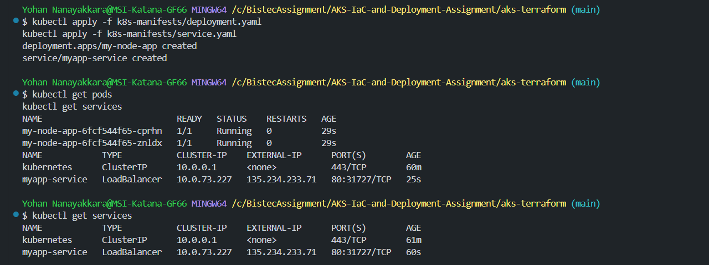

# AKS-IaC-and-Deployment-Assignment

# AKS Infrastructure as Code (IaC) and Deployment Assignment

## Overview

This project demonstrates setting up an **Azure Kubernetes Service (AKS) cluster** using **Terraform** and deploying a **custom containerized Node.js application** to it. The application is exposed using a Kubernetes LoadBalancer service, allowing external access.

---

## Prerequisites

Before running the project, ensure you have the following installed:

- [Azure CLI](https://learn.microsoft.com/en-us/cli/azure/install-azure-cli)
- [Terraform](https://developer.hashicorp.com/terraform/tutorials/aws-get-started/install-cli)
- [Docker](https://docs.docker.com/get-docker/)
- [kubectl](https://kubernetes.io/docs/tasks/tools/install-kubectl/)
- [Git](https://git-scm.com/book/en/v2/Getting-Started-Installing-Git)
- An **Azure account** with access to create an AKS cluster.

---

## Step 1: Setting Up the AKS Cluster Using Terraform

### 1️⃣ Initialize Terraform

```sh
terraform init
```

### 2️⃣ Plan Infrastructure

```sh
terraform plan
```

### 3️⃣ Apply Infrastructure Changes

```sh
terraform apply -auto-approve
```

After successful execution, Terraform will provision:

- An **Azure Resource Group**
- An **AKS Cluster** with **2 nodes**
- Role-based access control (RBAC) for the cluster

### 4️⃣ Connect to the AKS Cluster

```sh
az aks get-credentials --resource-group myAKSResourceGroup --name myAKSCluster
```

---

## Step 2: Build and Push the Custom Node.js Container

### 1️⃣ Navigate to the `my-node-app` Directory

```sh
cd my-node-app
```

### 2️⃣ Build the Docker Image

```sh
docker build -t my-node-app .
```

### 3️⃣ Tag the Image

For Docker Hub:

```sh
docker tag my-node-app <your-dockerhub-username>/my-node-app:v1
```

For Azure Container Registry:

```sh
docker tag my-node-app <your-acr-name>.azurecr.io/my-node-app:v1
```

### 4️⃣ Push the Image

For Docker Hub:

```sh
docker push <your-dockerhub-username>/my-node-app:v1
```

For Azure:

```sh
docker push <your-acr-name>.azurecr.io/my-node-app:v1
```

---

## Step 3: Deploy the Application to AKS

### 1️⃣ Apply Kubernetes Deployment and Service

```sh
kubectl apply -f k8s-manifests/deployment.yaml
kubectl apply -f k8s-manifests/service.yaml
```

### 2️⃣ Verify the Deployment

```sh
kubectl get pods
kubectl get services
```

### 3️⃣ Retrieve External IP

```sh
kubectl get services
```

Look for the **EXTERNAL-IP** under the `my-node-app-service` entry.

---

## Step 4: Test the Application

### 1️⃣ Test with cURL

```sh
curl http://<EXTERNAL-IP>
```

### 2️⃣ Open in a Browser

Visit:

```
http://<EXTERNAL-IP>
```

Or Do this:

```
curl http://localhost:8080
```


You should see:

```
Hello from my custom Node.js containerized app!
```

---

## Step 5: Cleaning Up Resources

To delete the AKS cluster and free resources, run:

```sh
terraform destroy -auto-approve
```

---

## Troubleshooting

### 1️⃣ External IP Shows `<pending>`

- Wait a few minutes for Azure to provision the LoadBalancer.
- Check service details:

```sh
kubectl describe service my-node-app-service
```

### 2️⃣ Check Logs for Errors

```sh
kubectl logs -l app=my-node-app
```

### 3️⃣ Restart a Pod

```sh
kubectl delete pod <pod-name>
```


## Deployment Success


## Kubernetes Service with External IP


## Running Node.js App in Browser


## 📌 Conclusion

This project successfully demonstrates how to: Provision an **AKS Cluster** using Terraform.  Build & push a **custom Node.js Docker container**. Deploy and expose the app on **Azure Kubernetes Service**.  Test and validate deployment via **cURL & browser**.


