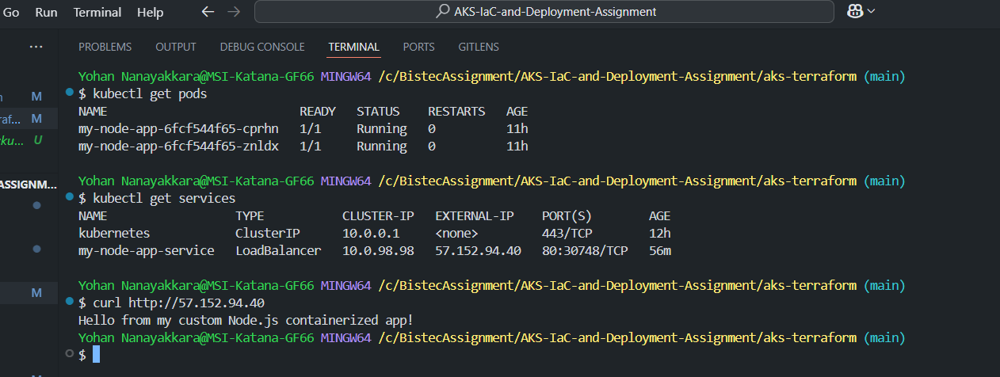
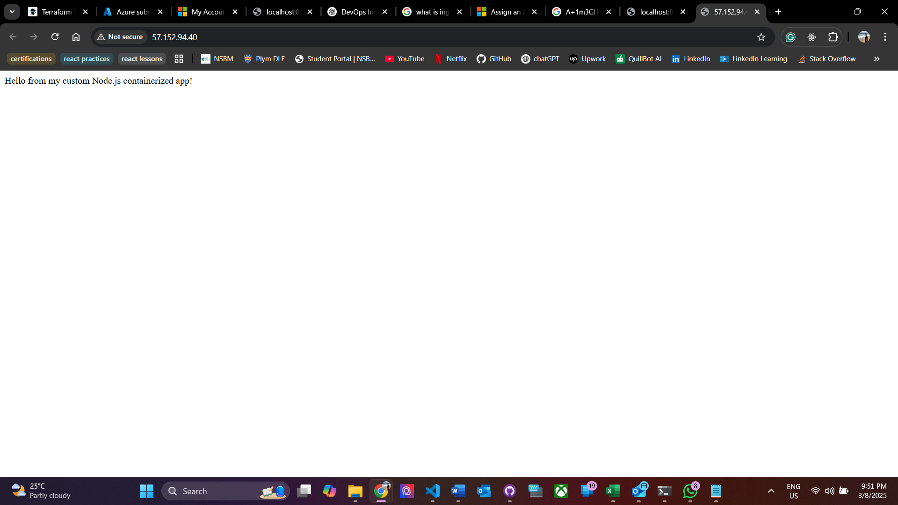

# AKS Infrastructure as Code (IaC) and Deployment Assignment

## Overview

This project demonstrates setting up an **Azure Kubernetes Service (AKS) cluster** using **Terraform** and deploying a **custom containerized Node.js application** to it. The application is exposed using a Kubernetes LoadBalancer service, allowing external access. Additionally, I've also added a state locking mechanism to ensure proper coordination when using the remote state file. This ensures that only one user or process can modify the state at a time, preventing potential conflicts and improving the reliability of the infrastructure setup.

---

## Prerequisites

Before running the project, ensure you have the following installed:

- Azure CLI
- Terraform
- Docker
- kubectl
- Git
- An **Azure account** with access to create an AKS cluster.

---

## Step 1: Setting Up the AKS Cluster Using Terraform

### Initialize Terraform

```sh
terraform init
```

### Plan Infrastructure

```sh
terraform plan
```

### Apply Infrastructure Changes

```sh
terraform apply -auto-approve
```

After successful execution, Terraform will provision:

- An **Azure Resource Group**
- An **AKS Cluster** with **2 nodes**
- Role-based access control (RBAC) for the cluster

### Connect to the AKS Cluster

```sh
az aks get-credentials --resource-group myAKSResourceGroup --name myAKSCluster
```

---

## Step 2: Build and Push the Custom Node.js Container

### Navigate to the `my-node-app` Directory

```sh
cd my-node-app
```

### Build the Docker Image

```sh
docker build -t my-node-app .
```

### Tag the Image


```sh
docker tag my-node-app <your-dockerhub-username>/my-node-app:v1
```


### Push the Image


```sh
docker push <your-dockerhub-username>/my-node-app:v1
```

---

## Step 3: Deploy the Application to AKS

### Apply Kubernetes Deployment and Service

```sh
kubectl apply -f k8s-manifests/deployment.yaml
kubectl apply -f k8s-manifests/service.yaml
```

### Verify the Deployment

```sh
kubectl get pods
kubectl get services
```

### Retrieve External IP

```sh
kubectl get services
```

Look for the **EXTERNAL-IP** under the `my-node-app-service` entry.

---

## Step 4: Test the Application

### Test with cURL

```sh
curl http://<EXTERNAL-IP>
```

### Open in a Browser

Visit:

```
http://<EXTERNAL-IP>
```

You should see:

```
Hello from my custom Node.js containerized app!
```

---

## Step 5: Cleaning Up Resources

To delete the AKS cluster and free resources, run:

```sh
terraform destroy -auto-approve
```

---

## Troubleshooting - External IP Address Issue

During the development, I encountered an issue where the external IP address was intermittently not functioning as expected. At times, I could only access the application through a local server port using port forwarding, which was not ideal.

However, after implementing a **state-locking mechanism** for the Terraform configuration, the issue with the external IP address was resolved. The state-locking mechanism ensured that only one process could modify the state at a time, which helped stabilize the deployment process and allowed the external IP to work reliably.

### Fix:
- **Before state-locking**: The external IP address was not consistently accessible, and the application could only be accessed through a local server using port forwarding.
- **After state-locking**: The external IP became functional and accessible as intended, preventing potential conflicts with state modifications during deployment.


## Deployment Success


## Kubernetes Service with External IP


## Running Node.js App in Browser



## Thank You!